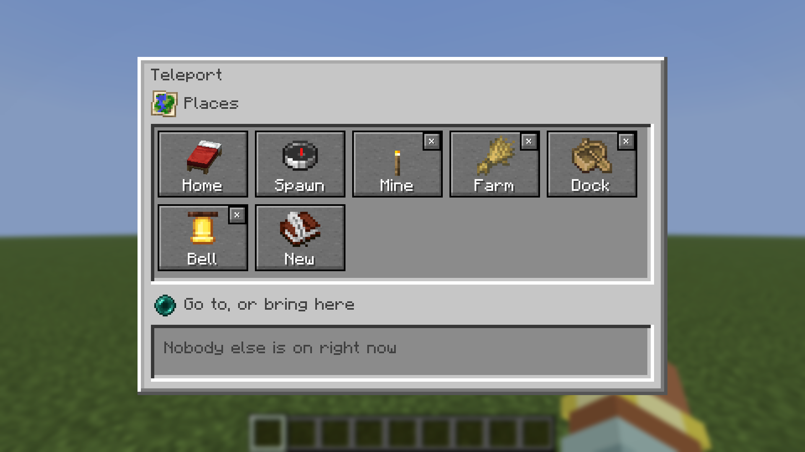
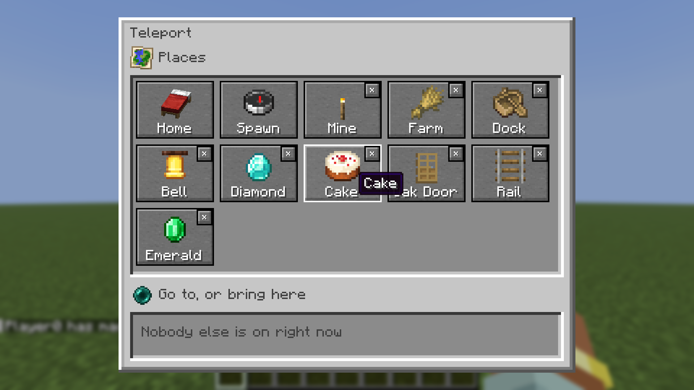

# TP Me Plz

A small teleport menu on a key, in pictures: a dialog with a big item on every place and a face on every player, so somebody still learning to read can use it.

- **Home** is your bed: wherever the game would respawn you, so a respawn anchor counts too, and sleeping somewhere new moves it. You come out standing beside it, the way waking up does, and an anchor's charge is not spent. With no bed, or a bed that has been broken, pressing it says to sleep in one.
- **Spawn**, the world's.
- **Last death**, where [Dead Heads](https://github.com/fatlard1993/dead-heads) is installed and you have died.
- **Geode**, where [Amethyst Door](https://github.com/fatlard1993/amethyst-door) is installed: into your own geode as if through a door where you stand, so its door brings you back here. Only a geode you already have; one is had by going through an amethyst door.
- **Your own places**, as many as the server allows (9 by default). **New** saves where you are standing, then shows a grid of pictures to pick from - a door, a sapling, a pickaxe, a boat, a bell and more, with whatever you are holding first - and a name box you can skip, in which case the place is named after its picture. Each place has a small ✕ in its corner to delete it, which asks first.
- **Every other player online**, with their face, and two ways to go: pressing their name asks to go to them, and the lead beside it asks them to come to you. Either way the other one decides - they say yes or no from chat, or from their own menu, where anyone asking shows at the top - and a request lapses after a minute. The picture says who travels: a pearl is you, a lead is them. With [Couch Controls](https://github.com/fatlard1993/couch-controls), a player on a controller is told which button opens the chat to answer it.

The menu keeps itself current while it is open: players coming and going, requests arriving and being answered. It is cut to your window: given the room it stands the places beside the people, and both lists scroll, so a full shelf of places and a full server of players fill it rather than running off the bottom of the screen.

## Getting there

Every trip puts you down *near* where you asked rather than exactly on it. The spot you saved is kept whenever it still works - a place saved in a mine stays in the mine - but where it does not, the nearest spot that does is used instead: on ground that holds you, clear of the wall or the lava that has grown over it since, and never inside somebody already standing there. Going to a player leaves you beside them rather than in them, and several people arriving at the same spot at once end up next to each other instead of in a pile. Where there is nothing safe within a few blocks you are still taken, and told to mind your step.

## Screenshots

## Who has it

By default, only players an op has given it to, and ops. A teleport for everyone changes what a long walk means on a server, so that is the server's decision:

- `/tpme grant <players>` and `/tpme revoke <players>` give and take it (ops).
- `access=everyone` in `config/tp-me-plz.properties`, or **Who has it** on the mod's page in the mod menu, gives it to every player.

Answering a request needs none of this: anyone asked can say yes or no, from chat or with `/tpme accept` and `/tpme deny`.

Asking somebody to come to **you** is the one place this cuts the other way. A yes moves *them*, so it is their teleporting being used, and the ask is refused unless they have it. Otherwise anyone given the menu could ferry somebody who was not, and the setting above would mean nothing.

## Opening it

**H** opens it. The key is **Teleport Menu**, under Pandorical in the controls, and on this mod's Keys tab in the mod menu, where it can be moved by pressing the key you want. H is put on once, for anyone who has not bound that slot to something else; moving or clearing it afterwards sticks. On a client older than Pandorical 1.3.9 the key starts unbound.

An ender pearl button at the top right of the inventory screen opens it too, for a controller, which has no button for the key.

`/tpme` opens the same menu, and each button is also a word: `/tpme home`, `spawn`, `death`, `geode`, `place <name>`, `newplace [name]` (pictured by what is in your hand), `delplace <name>`, `ask <player>` (go to them), `bring <player>` (ask them to come to you), `accept <player>`, `deny <player>`. On a client without Pandorical, `/tpme` lists the same choices in chat as clickable words.

## Requirements

- Minecraft 26.3 snapshots, Fabric Loader, Fabric API
- [Pandorical](https://github.com/fatlard1993/pandorical) 1.3.9 or later on the server, and on clients for the menu, the key and the inventory button; a client without it gets `/tpme` as clickable words in chat. The faces in the menu need Pandorical 1.3.9 or later on the client.

## Pandorical

Pandorical is required on the server. The menu of faces, the keybind that opens it, the button on
the inventory screen and the mod's page of the mod menu are all its. A client without Pandorical
keeps every part of the mod that is words: `/tpme` and the requests it sends arrive as clickable
text in chat.

## Configuration

`config/tp-me-plz.properties`:

| Setting | Default | |
|---|---|---|
| `access` | `granted` | `granted`: players given it with `/tpme grant`, and ops. `everyone`: every player. |
| `request_seconds` | `60` | How long a request to go to a player stands. |
| `max_places` | `9` | How many places of their own each player can save. |

All three are also on the mod's page of the mod menu, for ops.

## Development

Installing is in [DEVELOPMENT.md](DEVELOPMENT.md).

## License

MIT, see [LICENSE](LICENSE).
